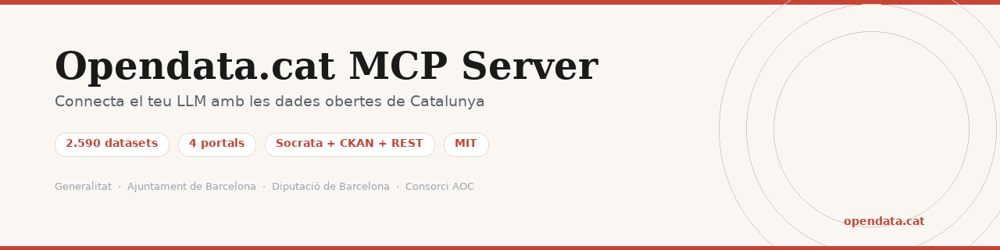

<p align="center">
  
</p>

<p align="center">
  <a href="https://www.npmjs.com/package/@opendata.cat/mcp-server"></a>
  <a href="https://www.npmjs.com/package/@opendata.cat/mcp-server"></a>
  <a href="https://github.com/xaviviro/Opendata.cat-MCP-Server"></a>
  <a href="https://opendata.cat/mcp"></a>
  <a href="https://opensource.org/licenses/MIT"></a>
</p>

# Opendata.cat MCP Server

Servidor [MCP](https://modelcontextprotocol.io/) (Model Context Protocol) que connecta els models de llenguatge (Claude, ChatGPT, Gemini...) amb les **dades obertes publiques de Catalunya**. Cerca datasets, explora metadades i consulta dades reals de 7 portals catalans directament des del teu assistent d'IA.

Un projecte d'**[opendata.cat](https://opendata.cat)** — associacio sense anim de lucre fundada el 2012 que promou la transparencia, la difusio i l'estandarditzacio de les dades obertes a Catalunya. Inspirat en el projecte [datagouv-mcp](https://github.com/datagouv/datagouv-mcp) del govern frances.

## Portals disponibles

| Portal | Datasets | APIs |
|--------|----------|------|
| [Generalitat de Catalunya](https://analisi.transparenciacatalunya.cat) | 1.058 | Socrata (SoQL) |
| [Ajuntament de Barcelona](https://opendata-ajuntament.barcelona.cat) | 555 | CKAN datastore |
| [Diputacio de Barcelona](https://dadesobertes.diba.cat) | 90 | REST + JSON:API (CIDO) |
| [Consorci AOC](https://dadesobertes.seu-e.cat) | ~893 | CKAN datastore |
| [Ajuntament de Reus](https://opendata.reus.cat) | 119 | CKAN datastore |
| [Ajuntament de Girona](https://www.girona.cat/opendata/) | 53 | CKAN datastore |
| [FGC (Ferrocarrils)](https://dadesobertes.fgc.cat) | 50 | Opendatasoft |

El Consorci AOC inclou datasets de les **diputacions de Tarragona, Girona i Lleida**, ajuntaments, consells comarcals i altres organismes publics catalans.

**+2.800 datasets** de 7 portals. La majoria queryables amb filtres, cerca i paginacio.

El cataleg s'actualitza automaticament cada setmana. Cada endpoint es valida per assegurar que funciona.

**Tipus d'acces:**
- **Socrata**: consulta SoQL amb filtres i cerca (Generalitat)
- **CKAN**: datastore_search amb filtres i cerca (Barcelona, AOC, Reus, Girona)
- **Diba REST**: API do.diba.cat amb paginacio i filtres (Diputacio BCN)
- **CIDO JSON:API**: api.diba.cat per contractacions, normatives, subvencions, oposicions, convenis (Diputacio BCN)
- **Opendatasoft**: API records amb filtres i cerca (FGC — horaris GTFS, trens temps real, estacions esqui)
- **File download**: descarrega directa de CSV, JSON, XLSX o fitxers GIS
- **Restricted**: requereix token d'autenticacio (4 datasets BSM)

## Installacio rapida

### Claude Desktop

Afegeix al fitxer de configuracio (`~/Library/Application Support/Claude/claude_desktop_config.json` a macOS o `%APPDATA%\Claude\claude_desktop_config.json` a Windows):

```json
{
  "mcpServers": {
    "opendata-cat": {
      "command": "npx",
      "args": ["-y", "@opendata.cat/mcp-server"]
    }
  }
}
```

### Claude Code (CLI)

```bash
claude mcp add opendata-cat -- npx -y @opendata.cat/mcp-server
```

### VS Code / Cursor

Afegeix al fitxer `.vscode/mcp.json` del teu projecte:

```json
{
  "servers": {
    "opendata-cat": {
      "command": "npx",
      "args": ["-y", "@opendata.cat/mcp-server"]
    }
  }
}
```

## Tools disponibles

| Tool | Descripcio |
|------|-----------|
| `search_datasets` | Cerca datasets per text lliure al cataleg |
| `get_dataset_info` | Retorna metadades completes: camps, tipus, llicencia, endpoint |
| `list_dataset_fields` | Llista els camps d'un dataset amb nom, tipus i descripcio |
| `query_dataset` | Consulta dades reals directament al portal origen |
| `list_portals` | Llista els portals disponibles amb estadistiques |
| `list_categories` | Llista categories i temes disponibles amb comptadors |
| `related_datasets` | Retorna datasets relacionats d'altres portals |

### search_datasets

Cerca datasets per text lliure.

```
query: "qualitat aire"
portal: "barcelona"        # opcional: generalitat, barcelona, diba, aoc, reus, girona, fgc
category: "Medi Ambient"   # opcional
limit: 20                  # opcional (defecte: 20)
```

### get_dataset_info

Retorna totes les metadades d'un dataset.

```
dataset_id: "generalitat:gn9e-3qhr"
```

### list_dataset_fields

Llista els camps d'un dataset amb nom, tipus i descripcio.

```
dataset_id: "generalitat:gn9e-3qhr"
```

### query_dataset

Executa una consulta directament contra el portal origen i retorna dades reals.

```
dataset_id: "generalitat:gn9e-3qhr"
filters: {"estaci": "Sau"}   # opcional
search: "embassament"         # opcional
limit: 20                     # opcional (defecte: 20, max: 100)
offset: 0                     # opcional
```

### list_portals

Llista els portals disponibles amb el nombre de datasets de cadascun. No requereix parametres.

### list_categories

Llista totes les categories i temes de datasets disponibles amb comptadors per portal. Ideal per descobrir quins tipus de dades hi ha.

## Prompts disponibles

Prompts predefinits que guien l'LLM pas a pas per fer analisis completes:

| Prompt | Descripcio | Arguments |
|--------|-----------|-----------|
| `estat_embassaments` | Estat actual dels embassaments amb grafiques d'evolucio | — |
| `trens_fgc_temps_real` | Retards, alertes i posicions dels trens FGC en temps real | — |
| `qualitat_aire` | Analisi de la qualitat de l'aire amb comparativa OMS/UE | `lloc` (opcional) |
| `accidents_transit` | Analisi d'accidents de transit amb punts negres i tendencies | `municipi` (opcional) |
| `pressupostos_municipals` | Pressupostos municipals amb desglossament per partides | `municipi` (opcional) |
| `compara_municipis` | Compara dos municipis en totes les dades disponibles | `municipi_a`, `municipi_b` |
| `descobreix_dades` | Mapa complet de dades obertes sobre un tema | `tema` |
| `analisi_bombers` | Actuacions dels Bombers: emergencies, distribucio, tendencies | `comarca` (opcional) |
| `novetats` | Datasets actualitzats mes recentment | `portal` (opcional) |
| `datasets_populars` | Datasets mes consultats pels usuaris | — |
| `explorar_portal` | Guia completa d'un portal: categories, exemples, destacats | `portal` |
| `dades_municipi` | Fitxa completa d'un municipi amb totes les dades disponibles | `municipi` |
| `datasets_temps_real` | Datasets amb dades en temps real o actualitzacio frequent | — |
| `resum_portals` | Visio panoramica de tots els portals de dades obertes | — |

## Exemples d'us

Un cop configurat, pots fer preguntes al teu LLM com:

- *"Quin es l'estat dels embassaments de Catalunya?"* → prompt `estat_embassaments`
- *"Hi ha algun tren de FGC amb retard ara mateix?"* → prompt `trens_fgc_temps_real`
- *"Analitza la qualitat de l'aire a Terrassa"* → prompt `qualitat_aire`
- *"Fes unes grafiques amb l'evolucio dels accidents de transit a Barcelona"* → prompt `accidents_transit`
- *"Compara Girona i Tarragona en dades obertes"* → prompt `compara_municipis`
- *"Quines dades obertes hi ha sobre educacio a Catalunya?"* → prompt `descobreix_dades`
- *"Dona'm les ultimes dades de pressupostos de Reus"* → prompt `pressupostos_municipals`
- *"Analitza les actuacions dels Bombers al Valles"* → prompt `analisi_bombers`
- *"Quines novetats hi ha en dades obertes?"* → prompt `novetats`
- *"Quins son els datasets mes consultats?"* → prompt `datasets_populars`
- *"Explora'm el portal de la Generalitat"* → prompt `explorar_portal`
- *"Quines dades obertes te Sabadell?"* → prompt `dades_municipi`
- *"Quines dades en temps real hi ha?"* → prompt `datasets_temps_real`
- *"Dona'm un resum de tots els portals"* → prompt `resum_portals`

## Com funciona

```
Usuari → LLM → MCP opendata.cat → API opendata.cat (cataleg)
                                 → Portal origen (dades reals)
```

1. L'MCP consulta l'[API d'opendata.cat](https://opendata.cat) per descobrir datasets rellevants
2. Quan l'usuari vol dades concretes, l'MCP fa la consulta directament al portal origen (Socrata o CKAN)
3. Les dades tornen a l'LLM, que les interpreta i presenta a l'usuari

No emmagatzema ni fa de proxy de dades. Cada consulta va directament a la font oficial.

## API REST

A mes del servidor MCP, opendata.cat ofereix una API REST publica per accedir al cataleg de datasets:

| Endpoint | Descripcio |
|----------|-----------|
| `GET /api/datasets.php?q=...` | Cerca datasets per text lliure |
| `GET /api/dataset.php?id=...` | Detall complet d'un dataset |
| `GET /api/categories.php` | Categories i portals amb comptadors |
| `GET /api/portals.php` | Portals de transparencia (1.769) |
| `GET /api/stats.php` | Estadistiques agregades |
| `GET /api/mcp-stats.php` | Metriques d'us del MCP |
| `POST /api/mcp` | Servidor MCP (Streamable HTTP) |

Documentacio interactiva (Swagger): **[opendata.cat/api/docs.html](https://opendata.cat/api/docs.html)**

Especificacio OpenAPI: [`opendata.cat/api/openapi.json`](https://opendata.cat/api/openapi.json)

## Sobre opendata.cat

[opendata.cat](https://opendata.cat) es una associacio catalana sense anim de lucre fundada el 2012 (registre 47468) dedicada a promoure la transparencia i l'acces a la informacio publica. Treballa en tres eixos: **estandarditzacio** de formats i protocols, **formacio** especialitzada per a professionals i administracions, i **collaboracio** publico-privada per a l'obertura de dades.

## Contribuir

Les contribucions son benvingudes! Per afegir un nou portal de dades obertes:

1. Obre una [issue](https://github.com/xaviviro/Opendata.cat-MCP-Server/issues) amb la URL del portal i el tipus d'API
2. O envia un pull request

## Changelog

### v0.0.16 (2026-04-14)
- Decodificador GTFS-RT integrat: trens FGC en temps real ara retornen dades reals (retards, alertes, posicions GPS)
- Descodifica automaticament fitxers Protocol Buffers (.pb) de GTFS Realtime
- API REST documentada amb Swagger UI a /api/docs.html (OpenAPI 3.1)
- Instruccions per a models locals: LM Studio, Ollama (MCPHost) i Jan
- Recomanacions de models oberts en catala (Softcatala): Qwen 3.5 9B, Gemma 3 12B

### v0.0.12 (2026-04-13)
- 14 prompts predefinits (8 analisi + 6 descobriment)
- Nous prompts: novetats, datasets_populars, explorar_portal, dades_municipi, datasets_temps_real, resum_portals
- Crawler incremental: UPSERT en lloc de TRUNCATE, no perd dades si un portal falla
- Backup automatic despres de cada carrega

### v0.0.10 (2026-04-13)
- Afegeix portal FGC (Ferrocarrils de la Generalitat de Catalunya) — 50 datasets via Opendatasoft
- Nou client Opendatasoft per consultar dades de transport, esqui, meteorologia, GTFS
- list_portals ara llista els 7 portals (abans nomes 3)
- Fix seguretat: validacio de claus de filtre SoQL contra injeccio
- Cobertura total: ~2.800 datasets de 7 portals

### v0.0.7 (2026-04-13)
- Afegeix portal Consorci AOC (~893 datasets de diputacions, ajuntaments, consells comarcals)
- Cobertura total: ~2.600 datasets, ~2.400 queryables
- Inclou dades de les diputacions de Tarragona, Girona i Lleida

### v0.0.6 (2026-04-12)
- Afegeix client CIDO (api.diba.cat) per contractacions, normatives, subvencions, oposicions, convenis
- Camps filtables reals extrets automaticament per cada endpoint CIDO

### v0.0.5 (2026-04-12)
- Gestio correcta de datasets no queryables (file_download, restricted)
- Retorna URL directa en comptes d'error quan un dataset no te API

### v0.0.4 (2026-04-12)
- Audit complet Barcelona i Diba: api_types correctes per cada dataset
- Barcelona: resource_id real via package_show (463 queryables)
- Diba: REST (do.diba.cat) + CIDO (api.diba.cat) + file_download
- Validador d'endpoints a /api/validate.php

### v0.0.3 (2026-04-12)
- Afegeix client Diba (do.diba.cat REST API) amb paginacio i filtres

### v0.0.2 (2026-04-12)
- Afegeix referencia al projecte datagouv-mcp del govern frances

### v0.0.1 (2026-04-12)
- Versio inicial: 3 portals (Generalitat, Barcelona, Diba)
- 6 tools: search_datasets, get_dataset_info, list_dataset_fields, query_dataset, list_portals, list_categories
- Publicat a npm com @opendata.cat/mcp-server

## Llicencia

MIT
